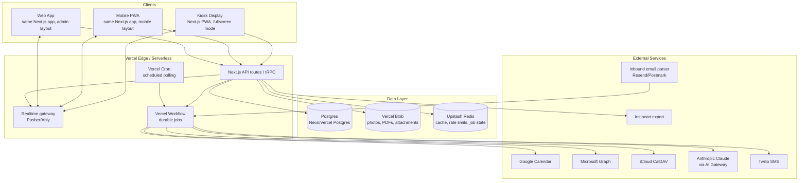
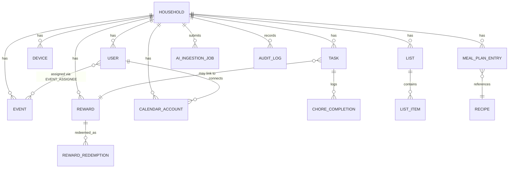
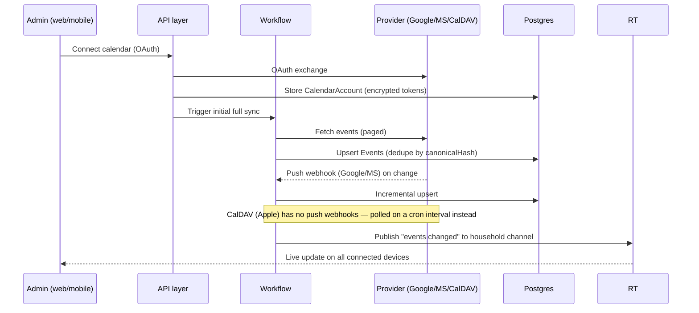

# Technical Design Document — Skylight-style Household OS

**Companion to:** [business-requirements.md](business-requirements.md)
**Document Version:** 1.0
**Status:** Draft — for review
**Scope:** Full architecture (Phases 1–4), implementation sequenced by phase

---

## 1. Decisions Locked In

These came out of discussion and shape everything below. Revisit them only if something downstream proves them wrong.

| Decision | Choice | Why |
|---|---|---|
| Household display | Kiosk **web app** (PWA) on off-the-shelf Android tablets / iPads / mini-PCs | No firmware/embedded workstream; fastest path to a working product; upgrade to custom hardware later without a rewrite |
| Mobile app | **PWA**, not React Native/native | One codebase serves display, mobile, and admin web; native app is a later phase if adoption justifies app-store presence |
| Stack | **TypeScript, Next.js, Node, Postgres, Vercel** | Single language end-to-end; first-class fit for Vercel AI SDK (Sidekick), Vercel Workflow (durable AI/sync jobs), and serverless hosting |

**Key implication:** because the display, mobile, and web "surfaces" from the PRD (§7) are all just responsive web clients now, they can ship as **one Next.js application** with device-aware layouts, not three separate apps. This collapses a huge amount of PRD-implied complexity (§24 "Device Linking" becomes "N browsers subscribed to one household's realtime channel," not a bespoke sync protocol). I've designed around this simplification throughout — flag if you actually want separate deployables per surface.

---

## 2. High-Level Architecture



**Core idea:** the API layer is the single source of truth. Every client (kiosk, mobile, web) reads/writes through it and gets pushed live updates through the realtime gateway. Anything slow, external, or AI-driven (calendar sync, Sidekick ingestion, notification scheduling) runs as a durable background workflow, never inline in a request.

---

## 3. Monorepo Structure

Turborepo, since we're all-TypeScript and want the display/mobile/web surfaces to share a component library and domain types.

```text
apps/
  app/            → the one Next.js app: kiosk, mobile, and admin layouts, routed by device mode
  ingest/         → inbound email webhook + external calendar webhook receivers (thin, if not colocated in apps/app)
packages/
  db/             → Prisma schema + generated client
  domain/         → zod schemas + TS types shared by API, workflows, and UI (Event, Task, Reward, ...)
  ui/             → shared component library (calendar grid, chore card, list item — used by all three layouts)
  ai/             → Sidekick prompts, extraction schemas, Claude client wrapper
  config/         → eslint/tsconfig/tailwind shared config
```

`apps/app` renders three layout modes off the same routes and data:
- `/display/*` — kiosk mode: fullscreen, no browser chrome, large touch targets, auto-wakes/sleeps
- `/m/*` — mobile-optimized PWA views for parents on the go
- `/*` (default) — desktop admin/web views for deeper configuration

Device mode is decided at pairing time (kiosk) or by viewport (mobile vs. desktop), not by a separate deployment.

---

## 4. Domain Model



### Key entities

**Household** — the tenant boundary. Every row in every other table carries `householdId`; all queries are scoped to it (see §7).

**User** (family member) — `role: admin | parent | child | guest | readonly`, `authMethod: password | oauth | pin`, nullable `email` (children may not have one), `colorHex`, `avatarUrl`, `ageCategory`.

**Device** — a paired kiosk display. `pairingCode`, `pairedAt`, `lastSeenAt`, `settings` (sleep schedule, brightness, locked layout). Not a "user" — a display authenticates as *the household*, optionally with a per-child PIN overlay to view personal-only info.

**CalendarAccount** — one per external connection (`provider: google | microsoft | apple_caldav`), encrypted OAuth tokens (or CalDAV app-password), `syncCursor`, `lastSyncedAt`, `status`.

**Event** — native fields per PRD §11 (title, start/end, location, people, recurrence, travel time, attachments, sub-tasks) plus `sourceProvider`/`sourceEventId` for synced events, and a `canonicalHash` used for de-duplication when the same event appears via multiple synced calendars.

**Task** — unifies one-time tasks, recurring tasks, chores, and routines (PRD §12–13) via a `type` enum, rather than separate tables. `frequency` stored as an RRULE string for anything recurring. **ChoreCompletion** is the append-only log of each occurrence being done — this is what lets "did Imran take out the trash today" be answered without mutating the Task row, and is what feeds the points ledger.

**Reward** / **RewardRedemption** — points are computed, not stored as a running balance on the user (avoids drift); a redemption references the ChoreCompletion rows that funded it and carries an approval state, satisfying PRD §14's "child cannot self-approve."

**List** / **ListItem** — one generic model backs grocery lists, custom lists (PRD §16–17), and AI-generated shopping items. Grocery lists are just `List{type: grocery}` populated by a meal-plan-derived job.

**Recipe** / **MealPlanEntry** — recipes are reusable; a meal plan entry places a recipe (or free text) on a household calendar date/slot.

**AIIngestionJob** — one row per Sidekick submission (email, photo, PDF, voice, text). Tracks `status`, the raw input's Blob URL, the model's extracted structured output, and what the user actually confirmed — this is the data behind the PRD §33 AI metrics (acceptance rate, correction rate).

**AuditLog** — append-only, `actorId` + `action` + `entityType/entityId` + diff. Required by PRD §27 and doubles as the trail an admin reviews for "what did the kids' devices do."

---

## 5. Auth & Permissions

Three distinct auth flows, because the PRD's personas don't share one login model:

1. **Adults (Admin/Parent/Guest/Read-only)** — Auth.js with email+password and Google/Microsoft OAuth (convenient since they're already connecting those calendars). Session scoped to a household.
2. **Children** — no email/password. A 4-digit PIN set by a parent, used to switch the active profile *on an already-paired household device* (kiosk or a parent's unlocked phone). A PIN alone never grants access from an unrecognized device — it only switches context within a household session that's already authenticated.
3. **Kiosk devices** — paired via a 6-digit code (shown on the display) entered once by an admin in the web/mobile app, like pairing a smart TV. The device then holds a long-lived device token identifying it as "a display belonging to Household X," independent of any single user's login.

**Authorization:** every API/tRPC procedure resolves `householdId` from the session/device token first, and all Prisma queries are middleware-wrapped to auto-inject `WHERE householdId = :current`. This is enforced in the application layer for MVP; Postgres Row-Level Security is a good hardening step for Phase 2+ once the schema is stable, but isn't a blocker for launch.

Role → capability matrix (from PRD §26) is a static table checked in the same middleware — e.g., `child` can `complete` a Task but not `delete` it or edit a Reward; `guest` gets read-only Event access with no Task/Reward visibility unless explicitly shared.

---

## 6. Calendar Sync Engine



- **Google & Microsoft**: OAuth + native push notifications (Google Calendar push channels / Microsoft Graph webhooks), with a periodic reconciliation poll as a safety net against missed webhooks.
- **Apple (iCloud)**: no public OAuth calendar API — integration is via **CalDAV with an app-specific password** the user generates in their Apple ID settings. This is real UX friction worth surfacing to the user during onboarding, and means Apple sync is poll-only (a Vercel Cron job on a 5–15 min interval per account).
- **Conflict/duplicate prevention**: a `canonicalHash` (title + start + end + source) lets the same event arriving via two connected calendars (e.g., a shared family Google Calendar visible to both parents) collapse to one Event row with multiple source refs, rather than duplicating.
- **Two-way sync**: writes made in-app propagate back to the provider for Google/Microsoft (supported by their APIs); CalDAV write-back is scoped to Phase 2 given the added complexity, with read-only iCloud sync as the Phase 1 baseline.

---

## 7. Real-Time Device Sync

Every household has one realtime channel (`household:{id}`). Any mutation (event created, chore completed, reward redeemed) publishes an event to that channel after the DB write commits; every connected kiosk/mobile/web client is subscribed and patches its local cache (SWR/React Query) on receipt.

Recommended provider: **Pusher Channels** (or Ably) rather than self-hosting WebSocket infrastructure — Vercel's serverless functions can't hold long-lived connections themselves, and a managed pub/sub service is the standard pairing here. Fallback: clients also poll on a long interval (e.g., 60s) so a missed realtime event self-heals.

**Offline kiosk behavior**: the display is a PWA with a service worker — it caches the last-known household state (today's events, open chores) and can render fully offline. Actions taken offline (marking a chore done) queue locally and flush when connectivity returns; the UI marks these as "pending sync" so a parent isn't misled about state that hasn't actually landed on the server yet.

---

## 8. AI Sidekick Pipeline (Phase 3)

```mermaid
flowchart LR
    IN[Input: email fwd / photo / PDF / text / voice] --> BLOB[Store raw input in Vercel Blob]
    BLOB --> JOB[Create AIIngestionJob]
    JOB --> WF[Vercel Workflow: extraction pipeline]
    WF --> CLAUDE["Claude (vision + text)\nstructured output via generateObject"]
    CLAUDE --> SCHEMA[Validate against zod schemas:\nEvent / Task / Meal / Recipe / ListItem]
    SCHEMA --> REVIEW[Present to user:\n'I found 3 household actions']
    REVIEW -->|Add All / edit / reject| WRITE[Write to domain services]
    WRITE --> AUDIT[AuditLog + AIIngestionJob.confirmed]
```



- **Inputs**: email-forwarding uses a per-household inbound address (`household-slug@ingest.yourdomain.com`) via an inbound-parsing webhook (Resend or Postmark); photo/PDF/screenshot upload from mobile/web; voice is transcribed first, then handled as text.
- **Extraction**: Claude's vision input handles photos/flyers/screenshots directly (no separate OCR step needed); the AI SDK's structured-output mode (`generateObject`) constrains the model to the same zod schemas used by the domain layer, so a successful extraction is already valid `Event`/`Task`/`Recipe`/`ListItem` data — no separate "parse the AI's text" step.
- **Human-in-the-loop by default**: nothing the assistant extracts is written until the user confirms (PRD §19's "Add all" tap). This is both a trust requirement and the mechanism that produces the acceptance/correction-rate metrics in PRD §33.
- **Durability**: this is a multi-step, potentially slow (vision model + multiple entities), externally-triggered (email webhook) pipeline — exactly what Vercel Workflow is for: each step (fetch input → call Claude → validate → notify user) is retried independently rather than the whole job failing if one step times out.

---

## 9. Household Agent (Phase 4)

Builds on the Sidekick pipeline rather than replacing it. The agent is a Claude tool-calling loop with **read tools** over Calendar/Task/Family/Meal services and a small number of **propose-write tools**, gated the same way as Sidekick: the agent can *draft* an action (reschedule, assignment suggestion, list addition) but a household-impacting write always surfaces as a confirmable suggestion (PRD §20's "Potential conflict detected... Possible actions") rather than executing silently.

"Household memory" (PRD §37) doesn't need a vector database initially — the structured Postgres data (events, tasks, past AI jobs, redemption history) already *is* the memory, and it's queried directly. A lightweight semantic search layer (e.g., embeddings over recipe notes or free-text list items) is worth adding only if free-text retrieval quality becomes a real gap — not a Phase 4 launch dependency.

Conflict detection (two events overlapping, or an event ending too close to another's start given travel time) runs as a scheduled job over each household's upcoming-24h window, using a travel-time API (Google Distance Matrix or Mapbox) for the "25 minutes away" style checks in PRD §20.

---

## 10. Notifications

A single **Notification** service fans out to channels: Web Push (VAPID — the only push option available without a native app, see §11 open question), email (Resend), and SMS (Twilio, likely gated to paid tier given per-message cost — ties into PRD §28's subscription split).

Two kinds of notification triggers:
- **Direct**: created immediately by domain events (chore assigned, reward redemption needs approval).
- **Scheduled/smart**: computed by background jobs — morning digest (cron, per household timezone), "leave in 15 minutes" (needs the event's location + travel time, computed close to departure), conflict warnings (from §9's conflict job).

---

## 11. Infrastructure Summary

| Concern | Choice |
|---|---|
| Hosting | Vercel (app + API routes/tRPC) |
| Database | Postgres — Neon or Vercel Postgres, via Prisma |
| File storage | Vercel Blob (photos, PDFs, screensaver images) |
| Cache / rate limiting | Upstash Redis |
| Realtime | Pusher Channels (or Ably) |
| Durable background jobs | Vercel Workflow (AI pipeline, calendar sync, scheduled notifications) |
| Scheduled triggers | Vercel Cron (CalDAV polling, morning digest, conflict scan) |
| AI | Anthropic Claude via Vercel AI Gateway + AI SDK |
| Email (outbound + inbound parse) | Resend |
| SMS | Twilio |
| Auth | Auth.js (adults) + custom PIN/device-token flows (children/kiosk) |
| Observability | Vercel Observability + Sentry |

---

## 12. Security & Privacy

Directly addressing PRD §27:
- TLS in transit everywhere (default on Vercel); Postgres encryption at rest (Neon/Vercel Postgres default) plus application-level encryption for OAuth tokens/CalDAV passwords specifically.
- RBAC enforced centrally in API middleware (§5), not scattered per-endpoint.
- Device auth is revocable per-device (an admin can "log out" a specific kiosk from the web app — invalidates its device token immediately).
- AuditLog covers all mutating actions with actor + household scope.
- Data export/delete: since everything is householdId-scoped, both are a matter of querying/purging all tables by that key — worth a single `householdDataService.export()`/`.purge()` utility rather than ad hoc per-table logic, so it stays correct as new tables are added.
- **AI privacy disclosures** (PRD §27): every Sidekick/agent interaction that leaves the household's own database (i.e., calls Claude) should be visible in that same AuditLog with what was sent and which provider processed it — this makes the "what data, why, retained?, which service" disclosure a UI view over existing audit data rather than a separate system.

---

## 13. Implementation Roadmap

Sequenced to match PRD §29–32, with the technical milestones this design implies:

**Phase 1 — Core Calendar & Household**
Monorepo scaffold; Household/User/Device schema + RBAC middleware; kiosk pairing flow; native Event CRUD + Google/Microsoft/Apple(CalDAV, read-only) sync; Day/Week/Month/Agenda views as shared components; Task/Chore CRUD + completion logging; custom Lists; Pusher realtime wiring; PWA shell with offline cache + web push.

**Phase 2 — Household Depth**
Recipes + meal planning + calendar drag-in; grocery list generation from meal plan + Instacart export; Rewards/points/redemption + approval workflow; multi-kiosk-per-household polish; photo screensaver; weather/countdown widgets; CalDAV write-back.

**Phase 3 — Sidekick**
Blob-backed ingestion + AIIngestionJob model; inbound email parsing address per household; Vercel Workflow extraction pipeline; Claude structured-output schemas for Event/Task/Recipe/ListItem; confirmation UI; AI audit trail feeding the acceptance/correction metrics.

**Phase 4 — Household Agent**
Tool-calling agent over existing services; conflict-detection scheduled job + travel-time integration; proactive notification generation; propose-then-confirm write gating.

---

## 14. Open Questions

These are genuine calls I'd want your input on before or during Phase 1 — I've picked a default for each so the design above isn't blocked, but flagging them explicitly:

1. **Web Push on iOS**: PWA push notifications on iPhones require the user to "Add to Home Screen" first (iOS 16.4+); a plain Safari tab can't receive push. Worth calling out during onboarding UX, or do we lean harder on email/SMS for iOS households in the interim?
2. **Apple Calendar scope for Phase 1**: given the app-specific-password friction (§6), should Apple/iCloud sync ship in Phase 1 alongside Google/Microsoft, or slip to a Phase 1.5 once the core loop is validated with the two easier providers?
3. **SMS tier placement**: Twilio has real per-message cost — should SMS notifications be Premium-tier only (fits PRD §28's subscription split), or a free-tier feature capped at low volume?
4. **Kiosk lockdown depth**: is "fullscreen PWA + settings-screen PIN" sufficient kiosk security for MVP, or do we need actual device-level lockdown (e.g., Android Enterprise/MDM-style kiosk mode) to stop a family member from swiping out to the tablet's home screen?
5. **Realtime vendor**: any existing preference/contract for Pusher vs. Ably vs. something else, or is "cheapest with a workable free tier" the right call for now?

Happy to go deeper on any one section (e.g., full Prisma schema, the tRPC router layout, or a screen-by-screen spec for Phase 1) — let me know where you want to go next.
